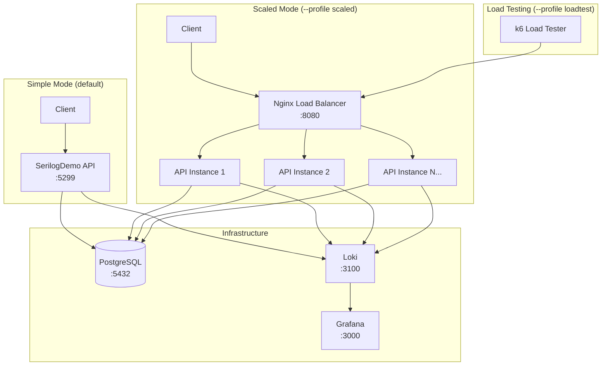
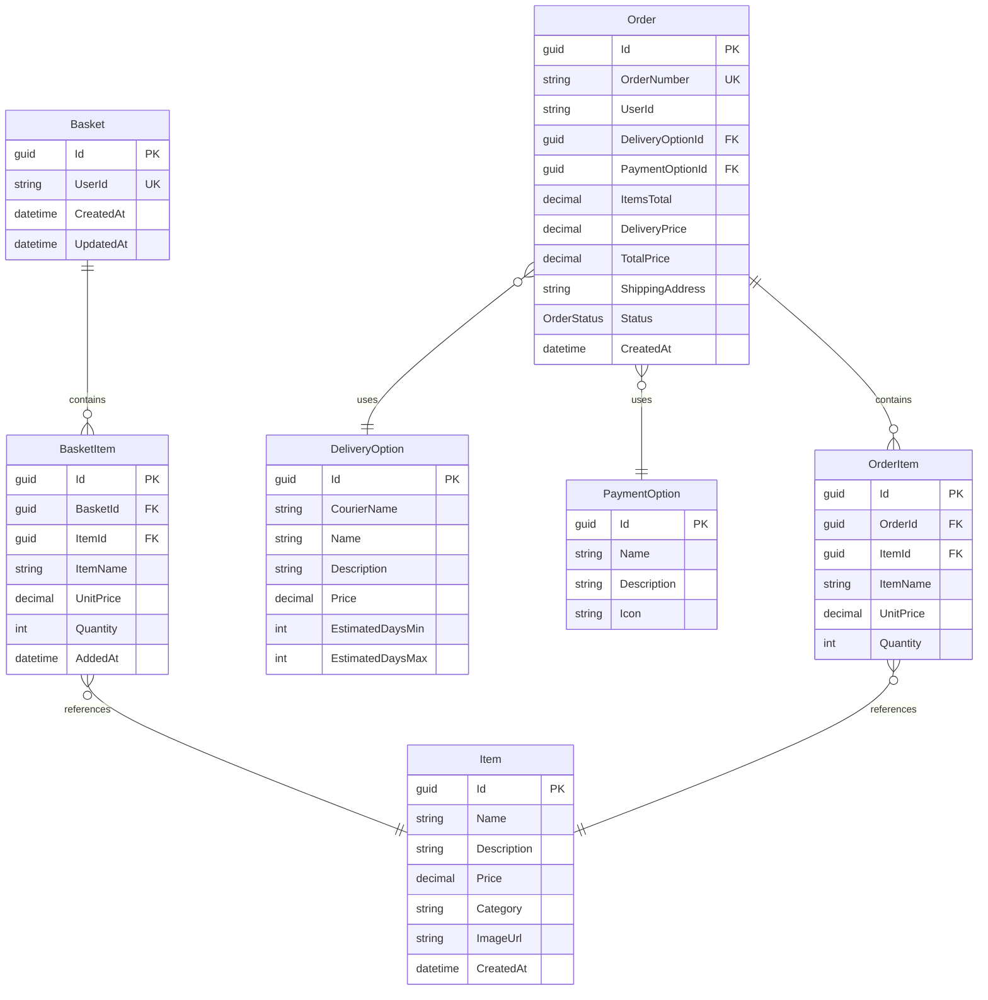

# Serilog E-Commerce Demo

This project demonstrates how Serilog can be utilized in a C# project with a simple e-commerce API, Grafana Loki integration, and PostgreSQL persistence.

Main branch is starting point. Each post of Serilog series posted on mateusz-dev.pl/blog has separate branch. This approach allows you to quickly fetch desired code and start building your own solution :)

Whole repo/code is open-source. Feel free to copy-paste and modify code to your liking.

## Architecture



## Database Schema



## Features

- **E-Commerce API** - Items catalog, shopping basket, delivery/payment options, order placement
- **Structured Logging** - All API operations log structured data with properties like UserId, OrderId, ItemId
- **Grafana Loki** - Centralized log aggregation and querying
- **PostgreSQL** - Persistent data storage with Entity Framework Core
- **Scalable Deployment** - Multi-instance deployment with Nginx load balancer
- **Load Testing** - k6-based load testing for benchmarking

## Prerequisites

- Docker and Docker Compose installed
- .NET 8.0 SDK (for local development)

## Quick Start

### Simple Mode (Single API Instance)

```bash
# Start infrastructure + API
docker compose --profile simple up -d

# Access points:
# - API: http://localhost:5299
# - Swagger: http://localhost:5299/swagger
# - Grafana: http://localhost:3000 (admin/admin)
```

### Scaled Mode (Multiple API Instances)

```bash
# Start with 3 API instances behind Nginx load balancer
docker compose --profile scaled up -d --scale api-scaled=3

# Access points:
# - API (via LB): http://localhost:8080
# - Grafana: http://localhost:3000 (admin/admin)
```

### With Load Testing

```bash
# Start scaled deployment with k6 load tester
docker compose --profile scaled --profile loadtest up -d --scale api-scaled=5

# k6 will automatically start generating traffic
# Monitor logs in Grafana
```

### Local Development

```bash
# Start only infrastructure
docker compose up -d

# Run API locally
dotnet run

# API: http://localhost:5299
```

## API Endpoints

### Items Catalog

| Method | Endpoint                           | Description           |
| ------ | ---------------------------------- | --------------------- |
| GET    | `/api/items`                       | Get all items         |
| GET    | `/api/items/{id}`                  | Get item by ID        |
| GET    | `/api/items/categories`            | Get all categories    |
| GET    | `/api/items/categories/{category}` | Get items by category |

### Shopping Basket

All basket endpoints require `X-User-Id` header to identify the user.

| Method | Endpoint                     | Description               |
| ------ | ---------------------------- | ------------------------- |
| GET    | `/api/basket`                | Get current user's basket |
| POST   | `/api/basket/items`          | Add item to basket        |
| PUT    | `/api/basket/items/{itemId}` | Update item quantity      |
| DELETE | `/api/basket/items/{itemId}` | Remove item from basket   |
| DELETE | `/api/basket`                | Clear entire basket       |

### Delivery Options

| Method | Endpoint                           | Description               |
| ------ | ---------------------------------- | ------------------------- |
| GET    | `/api/deliveryoptions`             | Get all delivery options  |
| GET    | `/api/deliveryoptions?courier=DPD` | Filter by courier         |
| GET    | `/api/deliveryoptions/{id}`        | Get delivery option by ID |

### Payment Options

| Method | Endpoint                   | Description              |
| ------ | -------------------------- | ------------------------ |
| GET    | `/api/paymentoptions`      | Get all payment options  |
| GET    | `/api/paymentoptions/{id}` | Get payment option by ID |

### Orders

All order endpoints require `X-User-Id` header.

| Method | Endpoint           | Description       |
| ------ | ------------------ | ----------------- |
| GET    | `/api/orders`      | Get user's orders |
| GET    | `/api/orders/{id}` | Get order details |
| POST   | `/api/orders`      | Place an order    |

### Health Check

| Method | Endpoint  | Description                           |
| ------ | --------- | ------------------------------------- |
| GET    | `/health` | Health check (used by load balancer)  |

## Usage Examples

All API requests are documented in the [SerilogDemo.http](SerilogDemo.http) file. 

Open this file in VS Code with the [REST Client extension](https://marketplace.visualstudio.com/items?itemName=humao.rest-client) or in JetBrains IDEs to execute requests directly from the editor.

The file includes:
- Complete shopping flow (browse → add to basket → checkout)
- All CRUD operations for basket management
- Delivery and payment option queries
- Order placement and history

## Querying Logs in Loki

### Via Grafana UI

1. Open `http://localhost:3000`
2. Go to **Explore** → Select **Loki** data source
3. Use LogQL queries:

```logql
# All logs from the application
{app="SerilogDemo"}

# Filter by log level
{app="SerilogDemo"} | json | Level="Error"

# Filter by UserId
{app="SerilogDemo"} |= "user-123"

# Filter by OrderId (structured)
{app="SerilogDemo"} | json | Properties_OrderId != ""

# Search for specific operations
{app="SerilogDemo"} |= "Order placed"
```

### Via HTTP API

```bash
# Query logs containing "Order placed"
curl -G "http://localhost:3100/loki/api/v1/query_range" \
  --data-urlencode 'query={app="SerilogDemo"} |= "Order placed"' \
  --data-urlencode "start=$(date -d '1 hour ago' +%s)000000000" \
  --data-urlencode "end=$(date +%s)000000000"
```

## Structured Logging Properties

The application logs structured data with the following key properties:

| Property      | Description                           | Example             |
| ------------- | ------------------------------------- | ------------------- |
| `UserId`      | User identifier from X-User-Id header | `user-123`          |
| `ItemId`      | Product item identifier               | `cc51f197-...`      |
| `OrderId`     | Order identifier                      | `fe6a2dd1-...`      |
| `OrderNumber` | Human-readable order number           | `ORD-20260123-1234` |
| `BasketId`    | Shopping basket identifier            | `58e2d1d1-...`      |
| `TotalPrice`  | Order/basket total                    | `739.94`            |
| `Quantity`    | Item quantity                         | `2`                 |

## Load Testing & Benchmarking

The project includes k6-based load testing for comparing structured logs (Loki) vs plain text (file) search performance.

### Running Load Tests

```bash
# Start scaled deployment
docker compose --profile scaled up -d --scale api-scaled=5

# Run k6 manually with custom parameters
docker run --rm -i --network serilogdemo_serilog-network \
  -v $(pwd)/k6:/scripts \
  grafana/k6 run /scripts/load-test.js \
  --vus 200 --duration 30m
```

### Test Scenarios

The load test simulates realistic e-commerce traffic:
- **40%** - Browse items only
- **25%** - Browse and add to basket
- **15%** - View basket contents
- **15%** - Complete checkout flow
- **5%** - Returning customer viewing orders

### Benchmarking Log Queries

After generating substantial logs (~1GB), compare query performance:

**Loki (structured):**
```bash
time curl -s "http://localhost:3100/loki/api/v1/query_range" \
  --data-urlencode 'query={app="SerilogDemo"} | json | Properties_OrderId="<order-id>"'
```

**File (grep):**
```bash
time grep "<order-id>" Logs/*.log
```

## Configuration

### Serilog (appsettings.json)

```json
{
  "Serilog": {
    "Using": ["Serilog.Sinks.Console", "Serilog.Sinks.File", "Serilog.Sinks.Grafana.Loki"],
    "WriteTo": [
      { "Name": "Console" },
      {
        "Name": "File",
        "Args": { "path": "Logs/log-.log", "rollingInterval": "Day" }
      },
      {
        "Name": "File",
        "Args": {
          "path": "Logs/structured-log-.json",
          "formatter": "Serilog.Formatting.Json.JsonFormatter, Serilog",
          "rollingInterval": "Day"
        }
      },
      {
        "Name": "GrafanaLoki",
        "Args": {
          "uri": "http://localhost:3100",
          "labels": [
            { "key": "app", "value": "SerilogDemo" },
            { "key": "environment", "value": "Development" }
          ]
        }
      }
    ]
  }
}
```

### PostgreSQL Connection (appsettings.json)

```json
{
  "ConnectionStrings": {
    "DefaultConnection": "Host=localhost;Port=5432;Database=ecommerce;Username=serilog;Password=serilog123"
  }
}
```

## Stopping Services

```bash
# Stop all services
docker compose --profile simple --profile scaled --profile loadtest down

# Also remove volumes (database data, logs)
docker compose --profile simple --profile scaled --profile loadtest down -v
```

## Project Structure

```
SerilogDemo/
├── Controllers/          # API Controllers
├── Data/                 # EF Core DbContext & Seeder
├── DTOs/                 # Data Transfer Objects
├── Models/               # Domain Entities
├── Migrations/           # EF Core Migrations
├── k6/                   # Load testing scripts
│   └── load-test.js
├── nginx/                # Load balancer config
│   └── nginx.conf
├── Logs/                 # Local log files
├── docker-compose.yml    # Container orchestration
├── Dockerfile            # API container image
├── SerilogDemo.http      # API request examples
└── appsettings.json      # Application configuration
```
