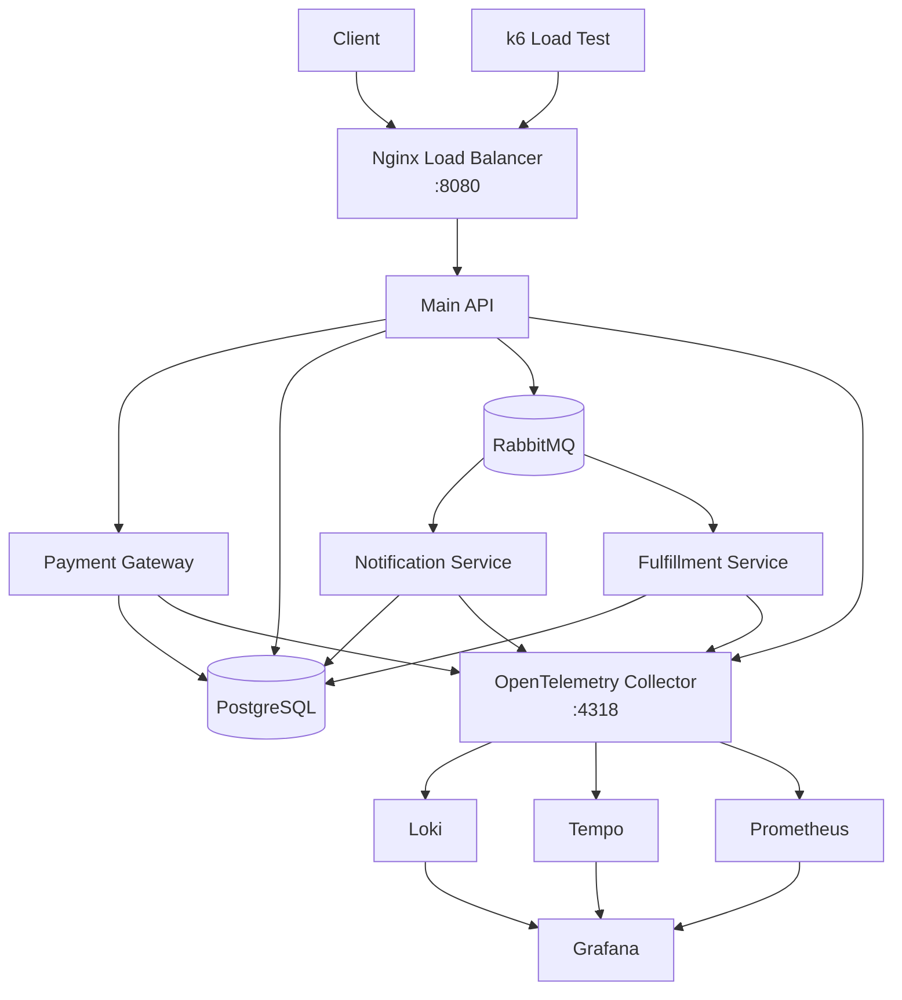

# OpenTelemetry E-Commerce Demo

This repository is a local, Docker-first demo of a moderately distributed e-commerce system instrumented with OpenTelemetry. The goal is to keep the domain simple while still showing realistic trace, log, metric, retry, and service-boundary examples.

Main branch is the starting point. Individual blog-post states live on separate branches.

## What This Repo Demonstrates

- A main e-commerce API behind Nginx
- A synchronous payment hop for clear end-to-end traces
- An asynchronous RabbitMQ fan-out for eventually consistent side effects
- Correlated traces, logs, and metrics across multiple .NET services
- A fully local observability stack with Grafana, Loki, Tempo, Prometheus, and PostgreSQL

## Architecture



## Main Flow

1. A client calls the main API through Nginx.
2. The main API validates basket and order data.
3. The main API calls the Payment Gateway synchronously.
4. On success, the main API stores an outbox record.
5. The outbox publisher sends an `order.paid` event to RabbitMQ.
6. Notification Service and Fulfillment Service each consume the same event from their own queue.
7. Notification can intentionally fail on the first attempt and succeed on retry for a deterministic demo.

This gives one synchronous trace segment and two asynchronous, broker-backed follow-up paths.

## Runnable Components

- Main API: this README and [SerilogDemo.http](SerilogDemo.http)
- Payment Gateway: [PaymentGateway/README.md](PaymentGateway/README.md)
- Notification Service: [NotificationService/README.md](NotificationService/README.md)
- Fulfillment Service: [FulfillmentService/README.md](FulfillmentService/README.md)
- Log Search Tools: [LogSearchTools/README.md](LogSearchTools/README.md)
- Observability Demo Queries: [observability/demo-queries.md](observability/demo-queries.md)
- Workshop Script: [observability/workshop-script.md](observability/workshop-script.md)

## Main API

The main API is the front door of the system. It owns the catalog, basket, delivery and payment-option lookup, order placement, payment orchestration, and outbox publication.

### Main API Features

- Catalog, basket, delivery, payment-option, and order endpoints
- Checkout orchestration with manual business spans
- Synchronous Payment Gateway integration
- Outbox persistence and RabbitMQ publishing for `order.paid`
- RabbitMQ fan-out to notification and fulfillment consumers with propagated trace context
- Structured logs and custom metrics for checkout flow

### Main API Required Configuration

- `ConnectionStrings__Postgres`: PostgreSQL connection string
- `PaymentGateway__BaseUrl`: Payment Gateway base URL
- `RabbitMq__HostName`: RabbitMQ host
- `RabbitMq__Port`: RabbitMQ port
- `RabbitMq__UserName`: RabbitMQ username
- `RabbitMq__Password`: RabbitMQ password
- `RabbitMq__VirtualHost`: RabbitMQ virtual host
- `RabbitMq__PublishEnabled`: enables or disables outbox publishing
- `RabbitMq__PublishIntervalSeconds`: outbox polling interval
- `OTEL_EXPORTER_OTLP_ENDPOINT`: OTLP base endpoint
- `OTEL_EXPORTER_OTLP_PROTOCOL`: exporter protocol, expected `http/protobuf`
- `OTEL_SERVICE_NAME`: logical service name, usually `serilogdemo-api`

Default local values are in [appsettings.json](appsettings.json).

## Quick Start

### Prerequisites

- Docker with `docker compose`
- .NET 8 SDK for local development

### Start Everything

```bash
docker compose up -d
```

### Scale Only the Main API

```bash
docker compose up -d --scale api=3
```

### Enable Load Test Profile

```bash
docker compose --profile loadtest up -d --scale api=5
```

### Access Points

- API and Swagger: `http://localhost:8080`
- Grafana: `http://localhost:3000`
- RabbitMQ Management: `http://localhost:15672`

## Request Samples

- Main API requests: [SerilogDemo.http](SerilogDemo.http)
- Payment Gateway requests: [PaymentGateway/PaymentGateway.http](PaymentGateway/PaymentGateway.http)

The main API order endpoint accepts the `X-Payment-Scenario` header for deterministic payment demos.

## Stopping Services

```bash
docker compose down
docker compose --profile loadtest down
docker compose --profile loadtest down -v
```

## Observability Notes

- All services export OTLP data through the OpenTelemetry Collector.
- The `order.paid` message carries W3C trace headers so the async consumers continue the producer trace.
- The demo is designed for trace-to-log correlation across service boundaries.
- The main API produces the most visible business spans around checkout.
- The Notification Service demonstrates async retry behavior after the HTTP request has already completed.
- The Fulfillment Service demonstrates a second independent consumer on the same event.

## Project Structure

```
SerilogDemo/
├── Controllers/                # Main API controllers
├── Data/                       # Main API DbContext and seeding
├── DTOs/                       # Main API contracts
├── Models/                     # Main API domain entities
├── Migrations/                 # Main API EF Core migrations
├── PaymentGateway/             # Synchronous payment service
├── PaymentGateway.Contracts/   # Shared payment contracts
├── NotificationService/        # Async notification consumer
├── FulfillmentService/         # Async fulfillment consumer
├── SerilogDemo.Messaging/      # Shared integration-event contracts
├── LogSearchTools/             # Optional log-search benchmark tool
├── observability/              # Grafana, Tempo, Loki, Prometheus, Collector config
├── nginx/                      # Nginx load balancer config
├── k6/                         # Load test scripts
├── docker-compose.yml          # Full local topology
├── Dockerfile                  # Main API container image
├── SerilogDemo.http            # Main API request samples
└── appsettings.json            # Main API defaults
```
