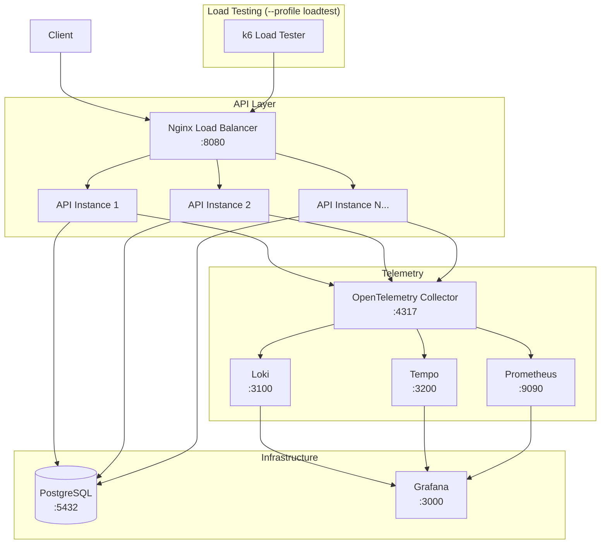
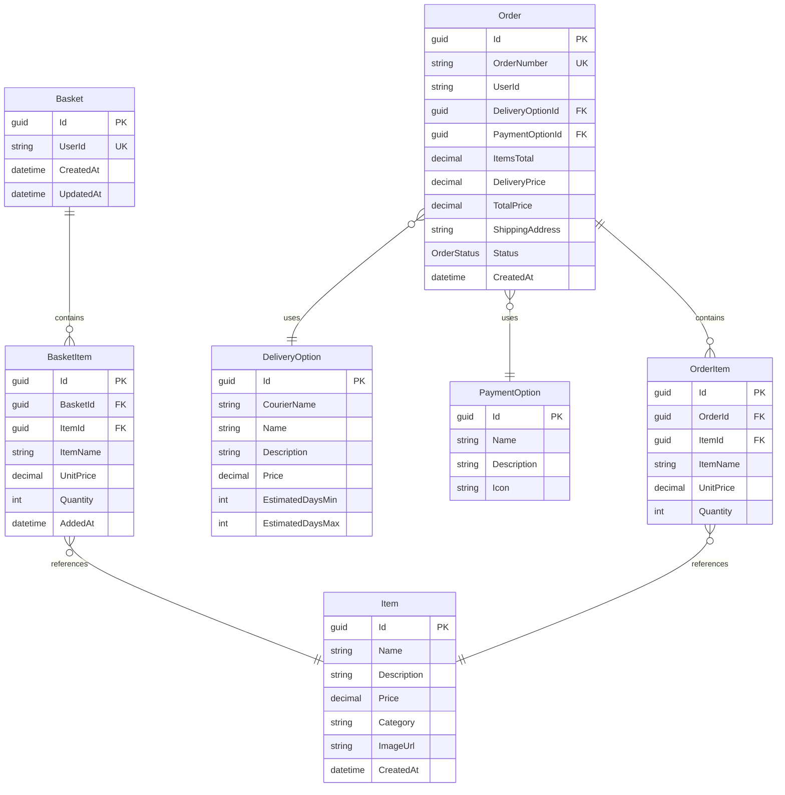

# OpenTelemetry E-Commerce Demo

This project demonstrates OpenTelemetry observability in a C# e-commerce API with Grafana visualization, Loki logs, Tempo traces, Prometheus metrics, and PostgreSQL persistence.

Main branch is starting point. Each post of Serilog series posted on mateusz-dev.pl/blog has separate branch. This approach allows you to quickly fetch desired code and start building your own solution :)

Whole repo/code is open-source. Feel free to copy-paste and modify code to your liking.

## Architecture



## Database Schema



## Features

- **E-Commerce API** - Items catalog, shopping basket, delivery/payment options, order placement
- **OpenTelemetry Signals** - Traces, metrics, and logs exported via OTLP
- **Grafana Stack** - Loki logs, Tempo traces, Prometheus metrics in one UI
- **Structured Logging** - All API operations log structured data with properties like UserId, OrderId, ItemId
- **PostgreSQL** - Persistent data storage with Entity Framework Core
- **Single Docker Entry Point** - Nginx fronts the API in both default and scaled runs
- **Load Testing** - k6-based load testing for benchmarking

## Prerequisites

- Docker and Docker Compose installed
- .NET 8.0 SDK (for local development)

## Quick Start

```bash
# Start infrastructure + one API instance behind Nginx
docker compose up -d

# Scale the API behind the same Nginx entry point
docker compose up -d --scale api=3

# Add the load test profile
docker compose --profile loadtest up -d --scale api=5

# Access points:
# - API: http://localhost:8080
# - Swagger: http://localhost:8080/swagger
# - Grafana: http://localhost:3000 (admin/admin)
```

## Stopping Services

```bash
# Stop the default stack
docker compose down

# If the load test profile is running, stop that profile too
docker compose --profile loadtest down

# Also remove volumes
docker compose --profile loadtest down -v
```

## API Requests

All API requests are documented in the [SerilogDemo.http](SerilogDemo.http) file. 

Open this file in VS Code with the [REST Client extension](https://marketplace.visualstudio.com/items?itemName=humao.rest-client) or in JetBrains IDEs to execute requests directly from the editor.

The file covers the main demo flow: browse items, manage a basket, choose delivery and payment options, place an order, and inspect logs.

## API Endpoints

### Items Catalog

| Method | Endpoint                           | Description           |
| ------ | ---------------------------------- | --------------------- |
| GET    | `/api/items`                       | Get all items         |
| GET    | `/api/items/{id}`                  | Get item by ID        |
| GET    | `/api/items/categories`            | Get all categories    |
| GET    | `/api/items/categories/{category}` | Get items by category |

### Shopping Basket

All basket endpoints require `X-User-Id` header to identify the user.

| Method | Endpoint                     | Description               |
| ------ | ---------------------------- | ------------------------- |
| GET    | `/api/basket`                | Get current user's basket |
| POST   | `/api/basket/items`          | Add item to basket        |
| PUT    | `/api/basket/items/{itemId}` | Update item quantity      |
| DELETE | `/api/basket/items/{itemId}` | Remove item from basket   |
| DELETE | `/api/basket`                | Clear entire basket       |

### Delivery Options

| Method | Endpoint                           | Description               |
| ------ | ---------------------------------- | ------------------------- |
| GET    | `/api/deliveryoptions`             | Get all delivery options  |
| GET    | `/api/deliveryoptions?courier=DPD` | Filter by courier         |
| GET    | `/api/deliveryoptions/{id}`        | Get delivery option by ID |

### Payment Options

| Method | Endpoint                   | Description              |
| ------ | -------------------------- | ------------------------ |
| GET    | `/api/paymentoptions`      | Get all payment options  |
| GET    | `/api/paymentoptions/{id}` | Get payment option by ID |

### Orders

All order endpoints require `X-User-Id` header.

| Method | Endpoint           | Description       |
| ------ | ------------------ | ----------------- |
| GET    | `/api/orders`      | Get user's orders |
| GET    | `/api/orders/{id}` | Get order details |
| POST   | `/api/orders`      | Place an order    |

### Health Check

| Method | Endpoint  | Description                          |
| ------ | --------- | ------------------------------------ |
| GET    | `/health` | Health check (used by load balancer) |

## Structured Logging Properties

The application logs structured data with the following key properties:

| Property      | Description                           | Example             |
| ------------- | ------------------------------------- | ------------------- |
| `UserId`      | User identifier from X-User-Id header | `user-123`          |
| `ItemId`      | Product item identifier               | `cc51f197-...`      |
| `OrderId`     | Order identifier                      | `fe6a2dd1-...`      |
| `OrderNumber` | Human-readable order number           | `ORD-20260409123045123-1A2B3C4D` |
| `BasketId`    | Shopping basket identifier            | `58e2d1d1-...`      |
| `TotalPrice`  | Order/basket total                    | `739.94`            |
| `Quantity`    | Item quantity                         | `2`                 |

## Load Testing

The project includes a k6 scenario that generates realistic e-commerce traffic against the Nginx entry point. See [k6](k6/load-test.js) configuration for more details.

## Configuration

### OpenTelemetry (appsettings.json)

```json
{
  "OpenTelemetry": {
    "ServiceName": "serilogdemo-api",
    "Protocol": "http/protobuf",
    "OtlpEndpoint": "http://localhost:4318"
  }
}
```

### PostgreSQL Connection (appsettings.json)

```json
{
  "ConnectionStrings": {
    "Postgres": "Host=localhost;Port=5432;Database=ecommerce;Username=serilog;Password=serilog123"
  }
}
```

## Project Structure

```
SerilogDemo/
├── Controllers/          # API Controllers
├── Data/                 # EF Core DbContext & Seeder
├── DTOs/                 # Data Transfer Objects
├── Models/               # Domain Entities
├── Migrations/           # EF Core Migrations
├── k6/                   # Load testing scripts
│   └── load-test.js
├── nginx/                # Load balancer config
│   └── nginx.conf
├── observability/        # OTEL/Grafana/Prometheus/Tempo/Loki configs
│   ├── otel-collector-config.yml
│   ├── grafana-datasources.yml
│   ├── prometheus.yml
│   ├── tempo.yml
│   └── loki-config.yml
├── docker-compose.yml    # Container orchestration
├── Dockerfile            # API container image
├── SerilogDemo.http      # API request examples
└── appsettings.json      # Application configuration
```
