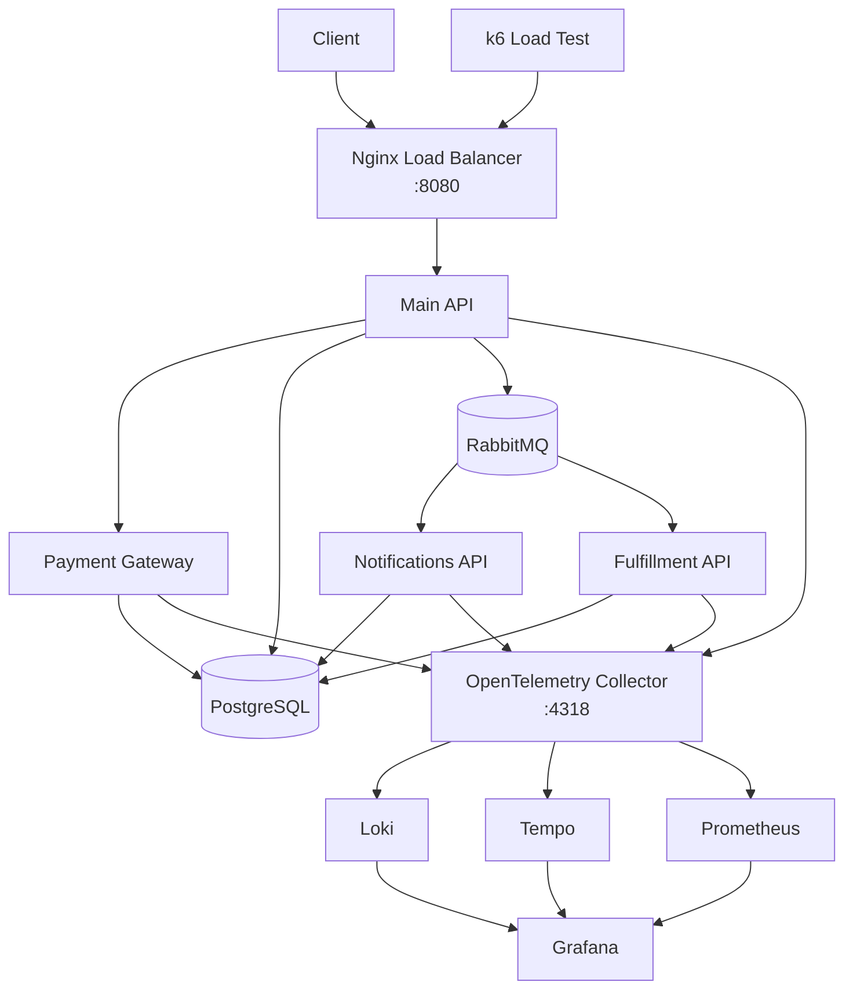

# OpenTelemetry E-Commerce Demo

This repository is a local, Docker-first demo of a moderately distributed e-commerce system instrumented with OpenTelemetry. The goal is to keep the domain simple while still showing realistic trace, log, metric, and service-boundary examples.

Main branch is the starting point. Individual blog-post states live on separate branches.

## What This Repo Demonstrates

- A main e-commerce API behind Nginx
- A synchronous payment hop for clear end-to-end traces
- An asynchronous RabbitMQ fan-out for eventually consistent side effects
- Correlated traces, logs, and metrics across multiple .NET services
- A fully local observability stack with Grafana, Loki, Tempo, Prometheus, and PostgreSQL

## Architecture



## Main Flow

1. A client calls the main API through Nginx.
2. The main API validates basket and order data.
3. The main API calls the Payment Gateway synchronously.
4. On success, the main API stores an outbox record.
5. The outbox publisher sends an `order.paid` event to RabbitMQ.
6. Notifications API consumes the same event on separate email and SMS queues, while Fulfillment API consumes it on its own queue.
7. Notifications API resolves fake user contact preferences, logs fake email or SMS payloads when the channel is enabled, and persists one delivery record per channel.

This gives one synchronous trace segment and multiple asynchronous, broker-backed follow-up paths. Fulfillment progression stays manual by default, and the warehouse-worker k6 script can automate collect, pack, and ship during load runs.

## Runnable Components

- Main API: this README and [SerilogDemo.http](SerilogDemo.http)
- Payment Gateway: [PaymentGateway/README.md](PaymentGateway/README.md)
- Notifications API: [NotificationsApi/README.md](NotificationsApi/README.md)
- Fulfillment API: [FulfillmentApi/README.md](FulfillmentApi/README.md)
- Log Search Tools: [LogSearchTools/README.md](LogSearchTools/README.md)
- Observability Demo Queries: [observability/demo-queries.md](observability/demo-queries.md)
- Workshop Script: [observability/workshop-script.md](observability/workshop-script.md)

## Main API

The main API is the front door of the system. It owns the catalog, basket, delivery and payment-option lookup, order placement, payment orchestration, and outbox publication.

### Main API Features

- Catalog, basket, delivery, payment-option, and order endpoints
- Checkout orchestration with manual business spans
- Synchronous Payment Gateway integration
- Outbox persistence and RabbitMQ publishing for `order.paid`
- RabbitMQ fan-out to notification and fulfillment consumers with propagated trace context
- Structured logs and custom metrics for checkout flow

### Main API Required Configuration

- `ConnectionStrings__Postgres`: PostgreSQL connection string
- `PaymentGateway__BaseUrl`: Payment Gateway base URL
- `RabbitMq__HostName`: RabbitMQ host
- `RabbitMq__Port`: RabbitMQ port
- `RabbitMq__UserName`: RabbitMQ username
- `RabbitMq__Password`: RabbitMQ password
- `RabbitMq__VirtualHost`: RabbitMQ virtual host
- `RabbitMq__PublishEnabled`: enables or disables outbox publishing
- `RabbitMq__PublishIntervalSeconds`: outbox polling interval
- `OTEL_EXPORTER_OTLP_ENDPOINT`: OTLP base endpoint
- `OTEL_EXPORTER_OTLP_PROTOCOL`: exporter protocol, expected `http/protobuf`
- `OTEL_SERVICE_NAME`: logical service name, usually `serilogdemo-api`

Default local values are in [appsettings.json](appsettings.json).

## Quick Start

### Prerequisites

- Docker with `docker compose`
- .NET 8 SDK for local development

### Start Everything

```bash
# Non scalable, single-instance demo topology
docker compose up -d

# Scalable main API with 3 instances behind Nginx
docker compose up -d --scale api=3

# Load test profile with 5 API instances plus ecommerce, warehouse, and restock k6 workers
docker compose --profile loadtest up -d --scale api=5
```

### Access Points

- API and Swagger: `http://localhost:8080`
- Grafana: `http://localhost:3001`
- RabbitMQ Management: `http://localhost:15672`

## Request Samples

- Main API requests: [SerilogDemo.http](SerilogDemo.http)
- Payment Gateway requests: [PaymentGateway/PaymentGateway.http](PaymentGateway/PaymentGateway.http)

The main API order endpoint accepts the `X-Payment-Scenario` header for deterministic payment demos.

## Load Test Model

This repo now uses three separate k6 scripts:

- [k6/load-test.js](k6/load-test.js): ecommerce users hitting the main API through Nginx with browse, basket, checkout, and order-status polling behavior.
- [k6/load-test-warehouse.js](k6/load-test-warehouse.js): warehouse workers hitting the Fulfillment API directly to collect, pack, ship, and inspect fulfillment backlog.
- [k6/load-test-restock.js](k6/load-test-restock.js): a replenishment worker that watches warehouse availability and tops stock back up through the existing warehouse API when items fall below a configurable low-water mark.

Run all three with the `loadtest` profile when you want end-to-end automated load with continuing order creation. Run only the ecommerce script when you want backlog to accumulate for manual fulfillment demos.

The restock worker keeps the test aligned with the business process: shipped orders still deduct real stock, and incoming replenishment restores availability instead of relying on unrealistically large seed inventory or bypassing reservation rules.

Useful restock environment variables for the `loadtest` profile:

- `RESTOCK_LOW_WATER_MARK`: when available quantity at or below this threshold becomes a replenishment candidate.
- `RESTOCK_TARGET_AVAILABLE_QUANTITY`: target available quantity to restore after replenishment.
- `RESTOCK_MAX_ITEMS_PER_CYCLE`: maximum number of items replenished per worker loop.
- `RESTOCK_POLL_SECONDS`: pause between replenishment cycles.
- `RESTOCK_CATEGORY_FILTER`: optional comma-separated category list to constrain replenishment.

## Stopping Services

```bash
docker compose down
docker compose --profile loadtest down
docker compose --profile loadtest down -v
```

## Observability Notes

- All services export OTLP data through the OpenTelemetry Collector.
- The `order.paid` message carries W3C trace headers so the async consumers continue the producer trace.
- The demo is designed for trace-to-log correlation across service boundaries.
- The main API produces the most visible business spans around checkout.
- The Notifications API demonstrates independent fake email and fake SMS handlers after the HTTP request has already completed.
- The Fulfillment API demonstrates a second independent consumer on the same event and exposes manual workflow controls.
- The warehouse-worker k6 script can drain fulfillment backlog during load runs without becoming part of the runtime architecture.
- The restock-worker k6 script keeps downstream traffic steady by replenishing finite warehouse stock through the same business API operators would use.

## Notifications API Schema

Notifications API owns the `notification_service` schema in PostgreSQL.

- `NotificationUsers`: fake recipient contact data and channel preferences, seeded with 10 demo users.
- `EmailNotificationDeliveries`: one record per handled email notification event, including destination, status, failure reason, and processed timestamp.
- `SmsNotificationDeliveries`: one record per handled SMS notification event, including destination, status, failure reason, and processed timestamp.

If a `UserId` from `order.paid` does not exist in `NotificationUsers`, Notifications API synthesizes a fake email address and phone number for that event and treats both channels as enabled. The migration that introduces this schema replaces the earlier `NotificationAttempts` table.

## Project Structure

```
SerilogDemo/
├── Controllers/                # Main API controllers
├── Data/                       # Main API DbContext and seeding
├── DTOs/                       # Main API contracts
├── Models/                     # Main API domain entities
├── Migrations/                 # Main API EF Core migrations
├── PaymentGateway/             # Synchronous payment service
├── PaymentGateway.Contracts/   # Shared payment contracts
├── NotificationsApi/           # Notification API host and async consumer
├── FulfillmentApi/             # Fulfillment API host and async consumer
├── SerilogDemo.Messaging/      # Shared integration-event contracts
├── LogSearchTools/             # Optional log-search benchmark tool
├── observability/              # Grafana, Tempo, Loki, Prometheus, Collector config
├── nginx/                      # Nginx load balancer config
├── k6/                         # Load test scripts
├── docker-compose.yml          # Full local topology
├── Dockerfile                  # Main API container image
├── SerilogDemo.http            # Main API request samples
└── appsettings.json            # Main API defaults
```
