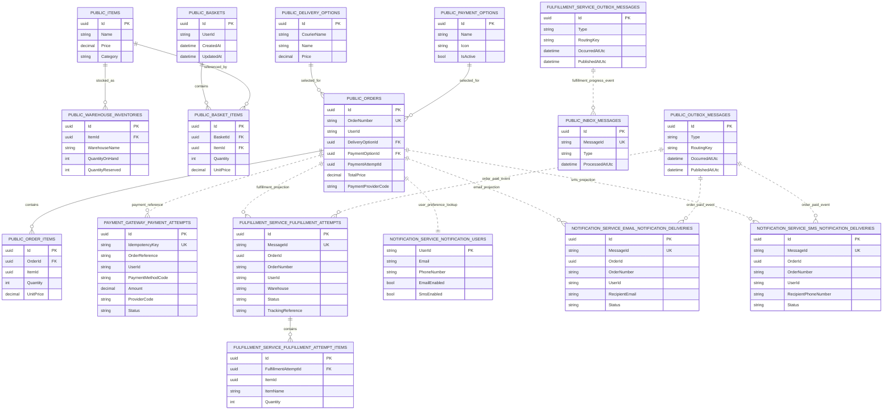

# Database Schema Overview

This repository uses one PostgreSQL database with four logical schemas owned by different services.

- `public`: main e-commerce API data
- `payment_gateway`: synchronous payment service data
- `fulfillment_service`: async fulfillment service data
- `notification_service`: async notification service data

Migration history tables are omitted from the diagram for clarity.

Schema prefix legend:

- `PUBLIC_*`: main API tables in the `public` schema
- `PAYMENT_GATEWAY_*`: payment service tables in the `payment_gateway` schema
- `FULFILLMENT_SERVICE_*`: fulfillment service tables in the `fulfillment_service` schema
- `NOTIFICATION_SERVICE_*`: notification service tables in the `notification_service` schema

Relationship legend:

- Solid lines: direct database relationships inside the owning schema
- Dotted lines: logical or message-driven cross-schema references, not enforced by PostgreSQL foreign keys

## Table Summary

### public schema

- `Items`: product catalog
- `WarehouseInventories`: per-item stock and reservation counts by warehouse
- `Baskets`: one basket per user session
- `BasketItems`: basket line items linked to baskets and catalog items
- `DeliveryOptions`: shipping methods used during checkout
- `PaymentOptions`: payment methods used during checkout
- `Orders`: placed orders with payment and fulfillment state
- `OrderItems`: order line items
- `InboxMessages`: idempotency store for consumed inbound integration messages
- `OutboxMessages`: pending and published integration events from the main API

### payment_gateway schema

- `PaymentAttempts`: idempotent authorization attempts keyed by `IdempotencyKey`

### fulfillment_service schema

- `FulfillmentAttempts`: downstream reservation and shipping workflow state for `order.paid`
- `FulfillmentAttemptItems`: item-level rows belonging to one fulfillment attempt
- `OutboxMessages`: fulfillment progress events waiting to be published

### notification_service schema

- `NotificationUsers`: fake user contact data and channel preferences, seeded with 10 demo users
- `EmailNotificationDeliveries`: one row per handled email notification
- `SmsNotificationDeliveries`: one row per handled SMS notification

## Cross-Schema Notes

- Only the `public` schema currently has direct relational foreign keys between most business tables.
- The other service schemas store downstream projections and workflow history keyed by values such as `OrderId`, `OrderNumber`, `UserId`, or `MessageId` rather than database-enforced cross-schema foreign keys.
- `public.OutboxMessages` is the source of `order.paid` fan-out into fulfillment and notification processing.